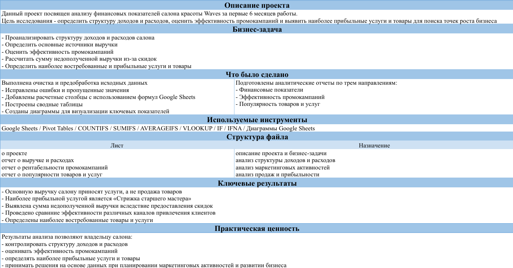
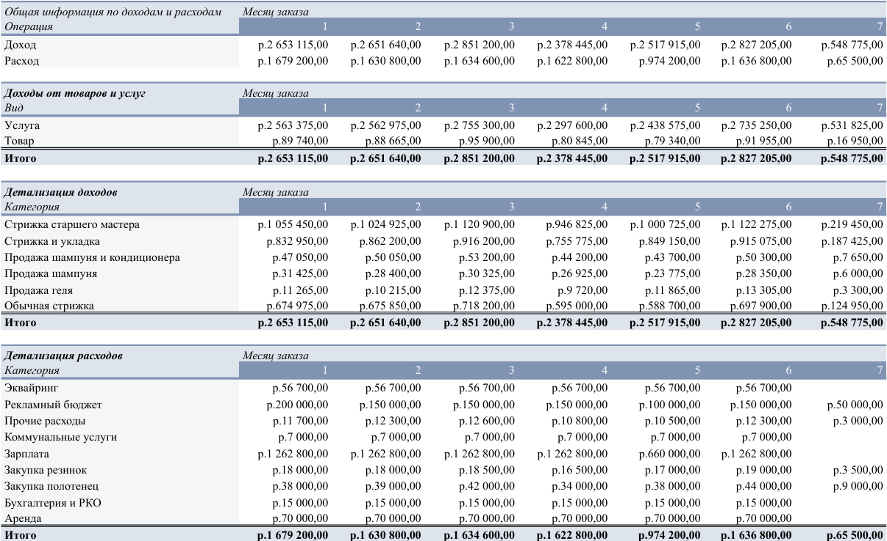
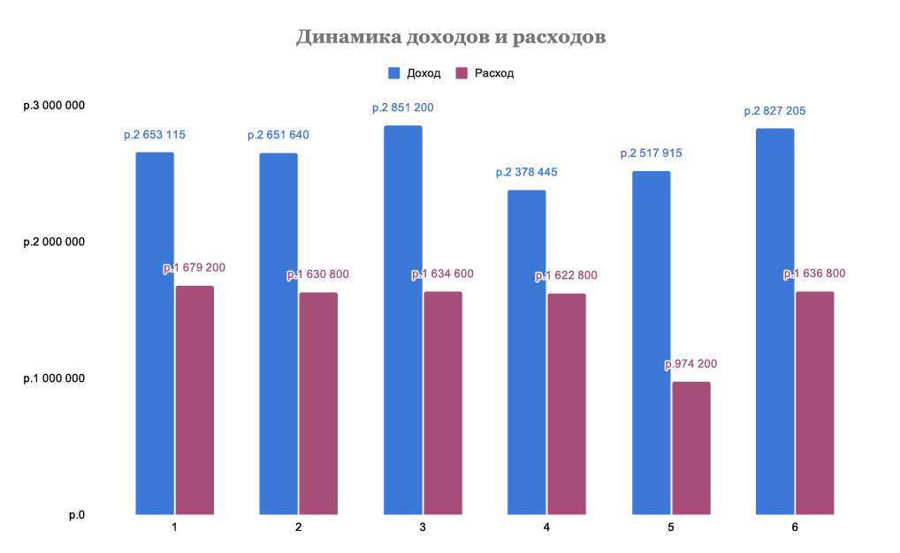
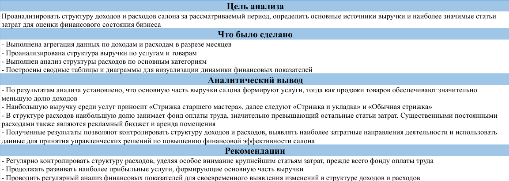
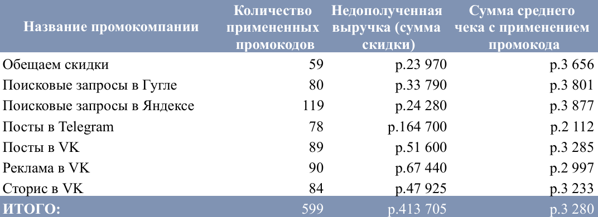
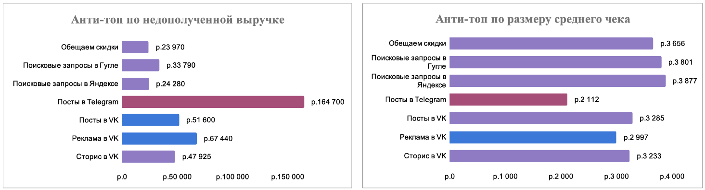
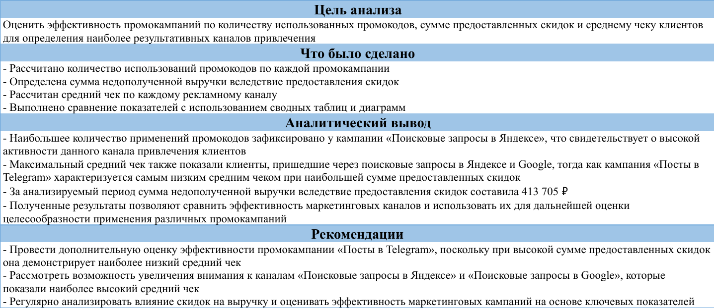
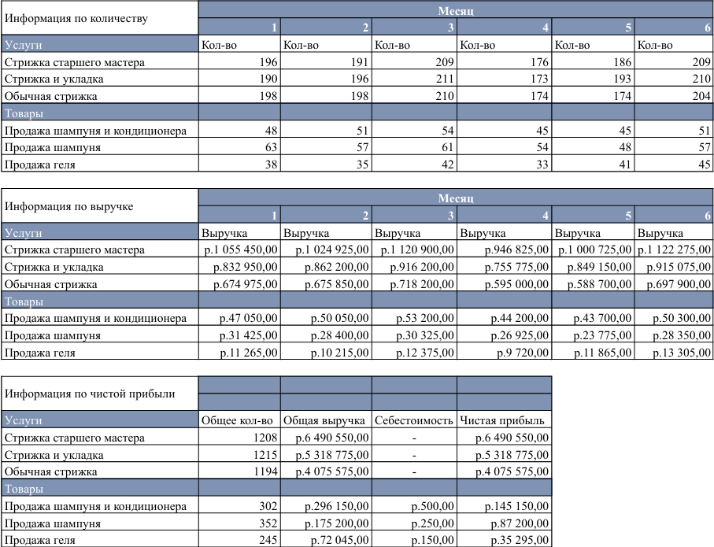
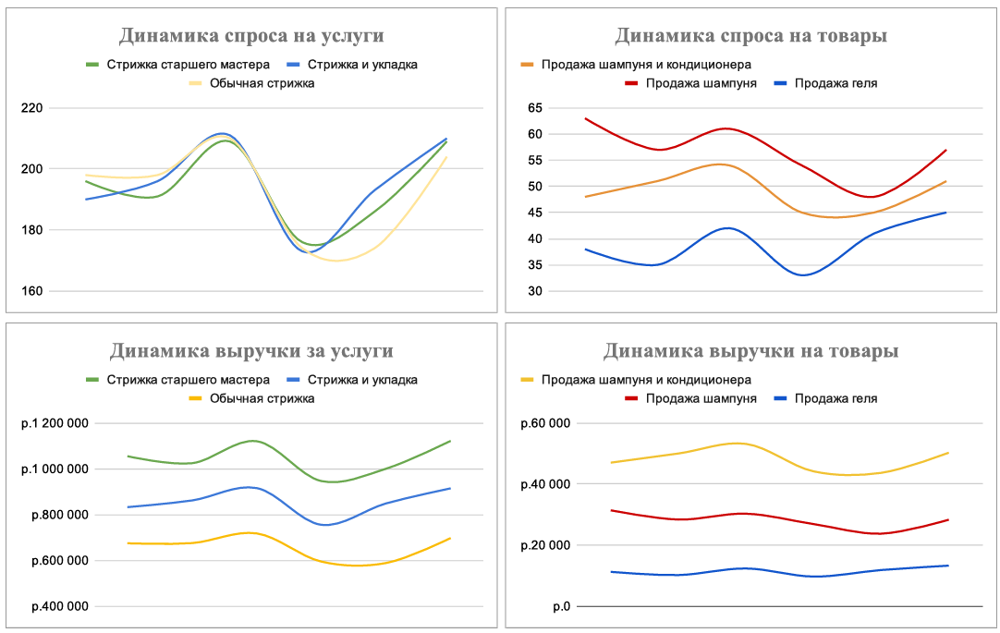
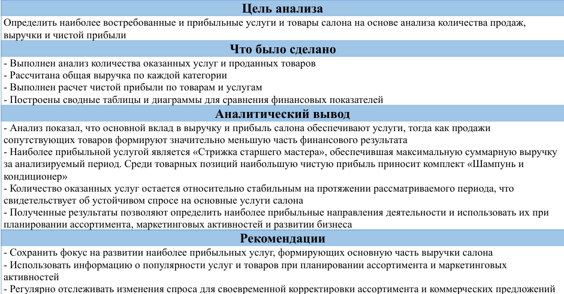

# Анализ финансовых показателей и эффективности промокампаний салона Waves

Проект посвящен анализу финансовых показателей салона красоты **Waves** за первые шесть месяцев работы.

В рамках проекта проведена предобработка данных, выполнен анализ структуры доходов и расходов, оценена 
эффективность промокампаний, а также определены наиболее востребованные и прибыльные товары и услуги.

---

## Ссылка на проект

**Google Sheets:**  
https://docs.google.com/spreadsheets/d/1jAz8-wNuUz7XIXg-Jxkcjp0GgP5ZuhzbbXP95ZSbr40/edit?usp=sharing

---

## Бизнес-задача

Перед аналитиком была поставлена задача определить точки роста бизнеса на основе операционных данных салона.

В ходе анализа требовалось:

- проанализировать структуру доходов и расходов;
- определить основные источники выручки;
- оценить эффективность промокампаний;
- рассчитать сумму недополученной выручки вследствие предоставления скидок;
- определить наиболее востребованные и прибыльные услуги и товары.

---

## Используемые инструменты

- Google Sheets
- Сводные таблицы (Pivot Tables)
- Формулы Google Sheets:
  - SUMIFS
  - COUNTIFS
  - AVERAGEIFS
  - VLOOKUP
  - IF
  - IFNA
- Очистка и предобработка данных
- Визуализация данных

---

## Этапы выполнения проекта

### Предобработка данных

- проверка качества исходных данных;
- удаление дубликатов и исправление ошибок;
- заполнение пропущенных значений;
- приведение данных к корректным форматам;
- создание дополнительных расчетных столбцов.

### Анализ данных

Проведен анализ по следующим направлениям:

- финансовые показатели;
- структура доходов и расходов;
- эффективность промокампаний;
- популярность товаров и услуг.

### Визуализация

Для представления результатов построены сводные таблицы и диаграммы, позволяющие оценить ключевые показатели деятельности салона.

---

## Основные результаты

В ходе анализа удалось:

- определить основные источники выручки салона;
- выявить наиболее прибыльные услуги;
- оценить влияние скидок на недополученную выручку;
- сравнить эффективность различных каналов привлечения клиентов;
- определить наиболее востребованные товары и услуги;
- подготовить аналитические отчеты с визуализацией ключевых показателей.

---

## Практическая ценность

Полученные результаты позволяют:

- контролировать структуру доходов и расходов;
- оценивать эффективность маркетинговых активностей;
- определять наиболее прибыльные направления бизнеса;
- принимать решения на основе данных при планировании развития салона.

---

## Структура проекта

| Лист | Содержание |
|------|------------|
| О проекте | Описание проекта, бизнес-задача, используемые инструменты и ключевые результаты |
| Отчет о выручке и расходах | Анализ структуры доходов, расходов и финансовых показателей |
| Отчет о рентабельности промокампаний | Анализ эффективности маркетинговых кампаний |
| Отчет о популярности товаров и услуг | Анализ продаж, выручки и прибыльности |

---

# Демонстрация проекта

Ниже представлены основные листы проекта Google Sheets, включающие таблицы, визуализации и аналитические выводы.

## Описание проекта

---

## Анализ выручки и расходов

### Таблицы

### Визуализации

### Аналитические выводы

---

## Анализ промокампаний

### Таблицы

### Визуализации

### Аналитические выводы

---

## Анализ товаров и услуг

### Таблицы

### Визуализации

### Аналитические выводы

---

## Автор

Проект выполнен в рамках обучения аналитике данных и демонстрирует навыки работы с Google Sheets, 
предобработкой данных, использованием функций, построением сводных таблиц, визуализацией данных 
и подготовкой аналитических выводов.