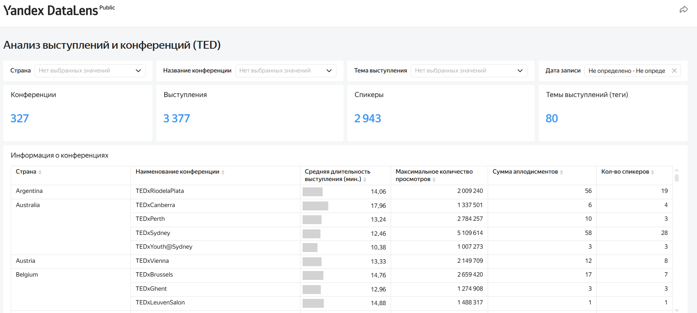
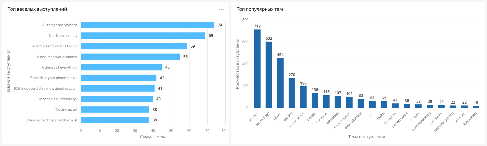
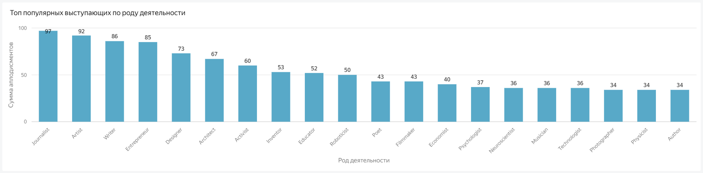

# Разработка интерактивного аналитического дашборда по данным конференций TED

## Описание проекта

Проект посвящен разработке интерактивного аналитического дашборда для анализа данных о конференциях TED.

Дашборд создан для поддержки принятия решений при организации новых мероприятий и позволяет 
исследовать ключевые показатели конференций, анализировать популярность тем и выступлений, 
оценивать вовлеченность аудитории и изучать характеристики спикеров.

В рамках проекта реализована возможность интерактивной фильтрации и детализации данных до уровня 
отдельных выступлений.

---

## Ссылка на проект

Yandex DataLens: https://datalens.yandex/wq2gu442ls9kg

---

## Цель проекта

Разработать аналитический инструмент, который поможет организаторам конференций учитывать опыт 
проведенных мероприятий при выборе тем, спикеров и формата будущих событий.

---

## Бизнес-задачи

В рамках проекта необходимо было:

- изучить основные показатели конференций;
- определить количество мероприятий, выступлений, спикеров и тематик;
- проанализировать популярность тем и отдельных выступлений;
- исследовать характеристики наиболее интересных аудитории спикеров;
- изучить параметры проведения конференций;
- реализовать возможность детализации информации по отдельным выступлениям.

---

## Используемые инструменты

- Yandex DataLens
- BI-визуализация данных
- Интерактивные дашборды
- Расчетные поля
- Фильтрация данных
- Детализация данных
- KPI-индикаторы
- Таблицы
- Столбчатые диаграммы
- Линейчатые диаграммы

---

## Реализованный функционал

В дашборде представлены:

- ключевые показатели по объему данных:
  - количество конференций;
  - количество выступлений;
  - количество спикеров;
  - количество тематик;

- анализ конференций:
  - средняя длительность выступлений;
  - максимальное количество просмотров;
  - количество аплодисментов;
  - количество выступающих;

- анализ выступлений:
  - топ самых смешных выступлений;
  - топ популярных тегов;

- анализ спикеров:
  - наиболее востребованные категории деятельности выступающих;

- детальная информация по каждому выступлению.

Также настроены интерактивные фильтры по:
- стране;
- названию конференции;
- тегу выступления;
- дате записи.

---

## Практическая ценность

Разработанный дашборд позволяет:

- анализировать опыт проведения предыдущих конференций;
- выявлять наиболее востребованные темы и направления;
- определять наиболее интересных аудитории спикеров;
- оценивать факторы, влияющие на популярность выступлений;
- принимать решения при подготовке новых мероприятий на основе данных.

---

## Структура проекта

| Файл | Описание |
| --- | --- |
| `images/01-dashboard-summary.png` | Главная страница дашборда с KPI-показателями и фильтрами |
| `images/02-talks-and-tags-analysis.png` | Анализ популярных выступлений и тематик |
| `images/03-speakers-analysis.png` | Анализ выступающих по роду деятельности |
| `images/04-talk-details.png` | Детальная информация по отдельным выступлениям |

---

## Демонстрация дашборда

### Главная страница дашборда

### Анализ выступлений и тематик

### Анализ выступающих

### Детальная информация о выступлениях

---

## Автор

Проект выполнен в рамках развития навыков аналитики данных и демонстрирует опыт разработки BI-решений, 
визуализации данных, создания интерактивных дашбордов и подготовки инструментов для поддержки 
принятия решений.