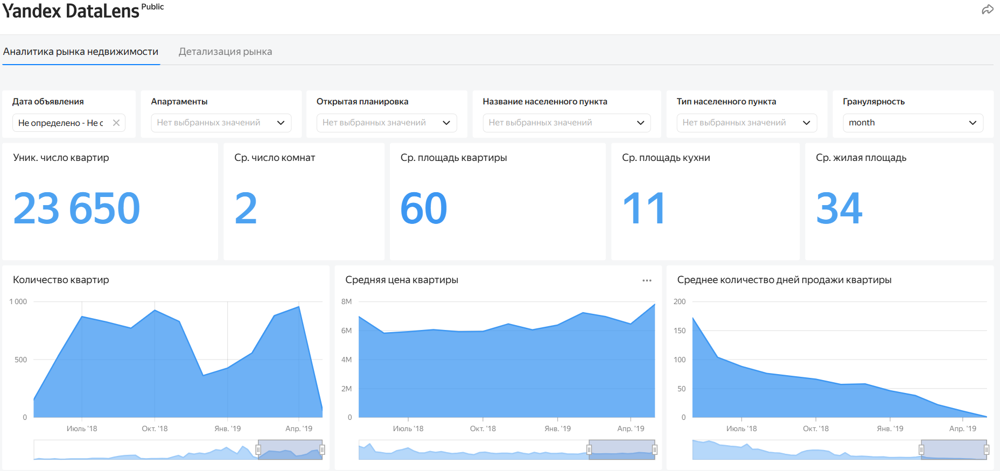
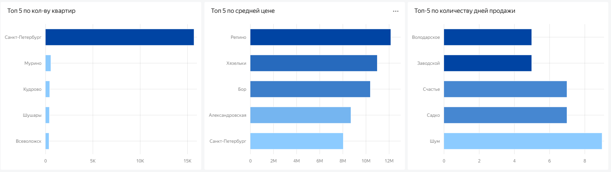
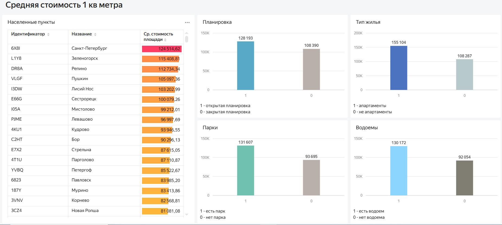
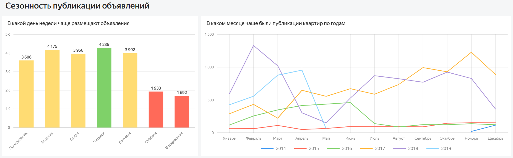

# Анализ рынка недвижимости Санкт-Петербурга и Ленинградской области

## Описание проекта

Проект посвящен анализу рынка недвижимости Санкт-Петербурга и городов Ленинградской области.

В рамках проекта проведен анализ характеристик объектов недвижимости, факторов, 
влияющих на скорость продажи квартир, а также сезонных тенденций рынка. 
На основе полученных данных разработан аналитический дашборд и подготовлена аналитическая записка 
с выводами и практическими рекомендациями.

## Ссылка на проект

Yandex DataLens: https://datalens.yandex/micwdmdbqr2o6

## Цель проекта

Определить особенности рынка недвижимости Санкт-Петербурга и Ленинградской области, 
выявить факторы, влияющие на скорость продажи объектов, оценить сезонные тенденции и подготовить 
рекомендации для повышения эффективности работы с объектами недвижимости.

## Бизнес-задачи

В рамках проекта необходимо было:

- исследовать распределение объектов недвижимости по срокам активности объявлений;
- определить характеристики квартир, влияющие на скорость продажи;
- сравнить особенности рынка Санкт-Петербурга и Ленинградской области;
- выявить периоды повышенной активности публикации и снятия объявлений;
- оценить влияние сезонных факторов на стоимость и характеристики объектов;
- подготовить аналитические выводы и рекомендации для оптимизации работы с недвижимостью.

## Используемые инструменты

- SQL
- PostgreSQL
- DBeaver
- Yandex DataLens
- BI-визуализация
- Расчетные поля
- KPI-индикаторы
- Аналитические отчеты
- Исследовательский анализ данных

## Этапы выполнения проекта

### Подготовка данных

- изучена структура исходных данных;
- выполнена проверка качества данных;
- подготовлены SQL-запросы для получения необходимых аналитических срезов;
- рассчитаны дополнительные показатели для анализа рынка недвижимости.

### Анализ данных

Проведен анализ:

- распределения объявлений по срокам активности;
- зависимости скорости продажи от характеристик объектов:
  - стоимости квадратного метра;
  - площади квартиры;
  - количества комнат;
  - площади кухни;
  - количества балконов;
  - параметров дома;
- различий между рынком Санкт-Петербурга и Ленинградской области;
- сезонной динамики публикации и снятия объявлений.

### Подготовка аналитических материалов

По результатам исследования:

- разработан интерактивный BI-дашборд в Yandex DataLens;
- подготовлена аналитическая записка с выводами;
- сформированы практические рекомендации для работы с объектами недвижимости.

## Реализованный функционал

В дашборде представлены:

- ключевые показатели рынка недвижимости;
- динамика количества объектов;
- анализ средней стоимости квартир;
- оценка среднего срока продажи объектов;
- рейтинг населенных пунктов по основным показателям;
- анализ стоимости квадратного метра;
- сезонный анализ публикации объявлений.

Также настроены:

- интерактивные фильтры по параметрам недвижимости;
- детализация данных по населенным пунктам;
- аналитические показатели для сравнения сегментов рынка.

## Основные результаты

В ходе анализа удалось:

- определить основные факторы, влияющие на скорость продажи недвижимости;
- выявить наиболее востребованные сегменты объектов;
- установить различия между рынками Санкт-Петербурга и Ленинградской области;
- определить период максимальной активности участников рынка;
- подготовить рекомендации по работе с объектами длительной продажи и планированию маркетинговых активностей.

Подробные результаты анализа представлены в аналитической записке.

## Практическая ценность

Полученные результаты позволяют:

- принимать решения на основе данных;
- оценивать особенности рынка недвижимости;
- выявлять наиболее перспективные сегменты объектов;
- определять направления для повышения эффективности продаж;
- планировать маркетинговые активности с учетом сезонных тенденций.

## Структура проекта

| Файл | Описание |
| --- | --- |
| [real-estate-market-analysis.sql](sql/real-estate-market-analysis.sql) | SQL-запросы для подготовки данных и проведения анализа |
| [real-estate-market-analysis-report.pdf](report/real-estate-market-analysis-report.pdf) | Аналитическая записка с выводами и рекомендациями |
| `images/01-dashboard-market-analytics-overview.png` | Основная страница дашборда с ключевыми показателями рынка |
| `images/02-dashboard-market-analytics-top-segments.png` | Анализ лидирующих населенных пунктов и сегментов рынка |
| `images/03-dashboard-market-details-price-analysis.png` | Детализация средней стоимости квадратного метра |
| `images/04-dashboard-market-details-seasonality.png` | Анализ сезонности публикации объявлений |

## Демонстрация дашборда

### Главная страница дашборда

### Анализ основных сегментов рынка

### Детализация стоимости квадратного метра

### Сезонность публикации объявлений

## Автор

Проект выполнен в рамках развития навыков аналитики данных и демонстрирует опыт работы с SQL, 
PostgreSQL, BI-визуализацией, разработкой аналитических дашбордов и подготовкой аналитических 
отчетов с бизнес-рекомендациями.