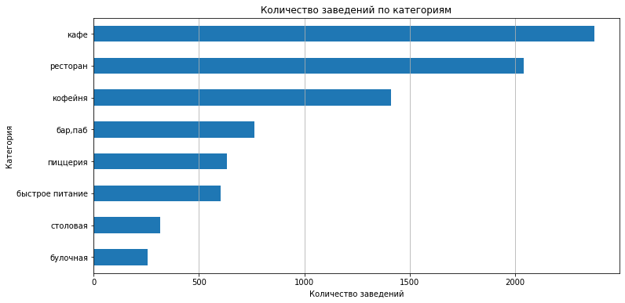
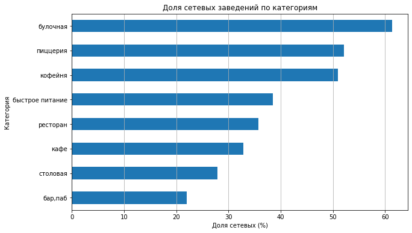
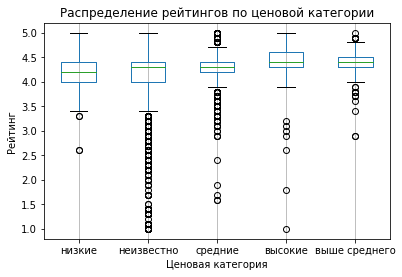
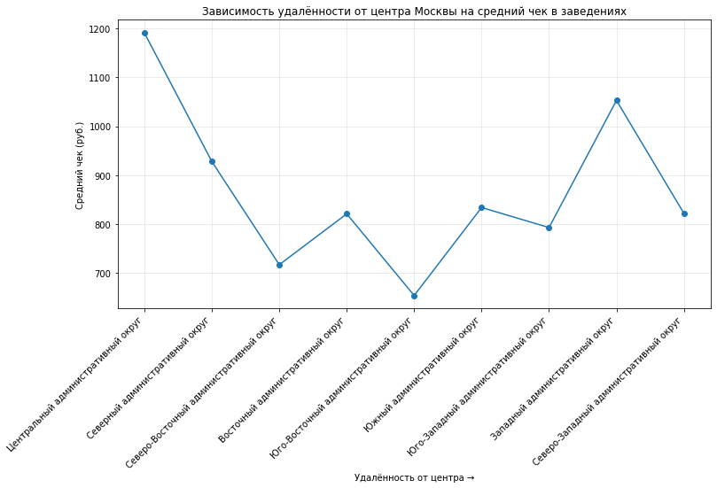

# Анализ рынка общественного питания Москвы

## Описание проекта

Проект посвящен исследованию рынка общественного питания Москвы с целью выявления особенностей 
заведений, их распределения по районам, ценовой политики и характеристик различных форматов бизнеса.

В рамках проекта проведен исследовательский анализ данных о заведениях общественного питания и 
их ценовых характеристиках. Изучены основные категории заведений, сетевые и несетевые форматы, 
географическое распределение, вместимость, рейтинги и факторы, связанные с оценками посетителей.

По результатам анализа сформированы выводы о текущей структуре рынка и подготовлены рекомендации 
для потенциальных инвесторов при выборе формата заведения, локации и ценовой стратегии.

---

## Цель проекта

Определить особенности рынка общественного питания Москвы, выявить основные характеристики 
успешных форматов заведений и подготовить рекомендации для выбора перспективной бизнес-модели.

---

## Бизнес-задачи

В рамках проекта необходимо было:

- исследовать структуру рынка общественного питания Москвы;
- определить наиболее распространенные категории заведений;
- оценить распределение заведений по административным районам;
- сравнить сетевые и несетевые форматы;
- проанализировать вместимость заведений и особенности различных категорий;
- изучить распределение рейтингов и ценовых категорий;
- выявить взаимосвязи между характеристиками заведений и рейтингами;
- определить перспективные направления для масштабирования бизнеса.

---

## Используемые инструменты

- Python
- pandas
- matplotlib
- seaborn
- Jupyter Notebook
- Исследовательский анализ данных (EDA)
- Визуализация данных
- Корреляционный анализ

---

## Этапы выполнения проекта

### Предобработка данных

- проведена проверка качества исходных данных;
- обработаны пропуски и дубликаты;
- выполнено объединение данных о заведениях и ценовых характеристиках;
- созданы дополнительные признаки для анализа.

### Исследовательский анализ данных

Проведен анализ:

- структуры рынка по категориям заведений;
- распределения заведений по административным районам Москвы;
- соотношения сетевых и несетевых форматов;
- количества посадочных мест;
- рейтингов заведений;
- ценовых категорий;
- популярных сетевых форматов;
- взаимосвязи характеристик заведений с рейтингом.

### Подготовка выводов и рекомендаций

На основе результатов анализа сформированы выводы о структуре рынка и подготовлены 
рекомендации по выбору формата заведения, локации и ценовой стратегии.

---

## Основные результаты

В ходе анализа удалось:

- определить основные категории заведений, формирующие рынок общественного питания Москвы;
- выявить наибольшую концентрацию заведений в Центральном административном округе;
- установить, что несетевые заведения преобладают на рынке, однако отдельные категории 
(кофейни, пиццерии, булочные) имеют высокую долю сетевых форматов;
- определить типичные значения вместимости для различных категорий заведений;
- изучить особенности распределения рейтингов и ценовых категорий;
- выявить наличие слабой положительной связи между ценовой категорией и рейтингом заведений;
- определить форматы с потенциалом масштабирования, среди которых выделяются кофейни, пиццерии и булочные.

---

## Практическая ценность

Полученные результаты позволяют:

- принимать решения на основе данных при выборе формата заведения;
- оценивать особенности различных сегментов рынка;
- определять перспективные направления развития бизнеса;
- учитывать влияние локации, ценовой категории и формата заведения при разработке стратегии.

---

## Структура проекта

| Файл | Описание |
| --- | --- |
| [notebooks/moscow_restaurants_analysis.ipynb](notebooks/moscow_restaurants_analysis.ipynb) | Jupyter Notebook с процессом обработки данных, исследовательским анализом и визуализацией результатов |
| `images/01-establishments-by-category.png` | Распределение заведений по категориям |
| `images/02-establishments-by-administrative-district.png` | Распределение заведений по административным районам Москвы |
| `images/03-chain-share-by-category.png` | Доля сетевых заведений по категориям |
| `images/04-chain-vs-nonchain-by-category.png` | Сравнение сетевых и несетевых заведений по категориям |
| `images/05-rating-distribution-by-price-category.png` | Распределение рейтингов по ценовым категориям |
| `images/06-distance-from-center-vs-average-bill.png` | Зависимость среднего чека от удаленности от центра |

---

## Демонстрация проекта

### Распределение заведений по категориям

### Распределение заведений по административным районам Москвы

### Доля сетевых заведений по категориям

### Сетевые и несетевые заведения по категориям

### Распределение рейтингов по ценовым категориям

### Зависимость среднего чека от удаленности от центра

---

## Автор

Проект выполнен в рамках развития навыков аналитики данных и демонстрирует опыт работы с Python, 
исследовательским анализом данных, визуализацией, анализом бизнес-показателей и подготовкой 
аналитических выводов.