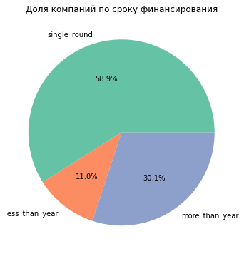
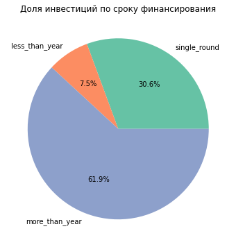
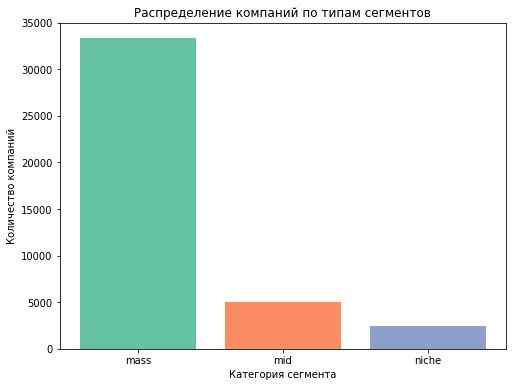
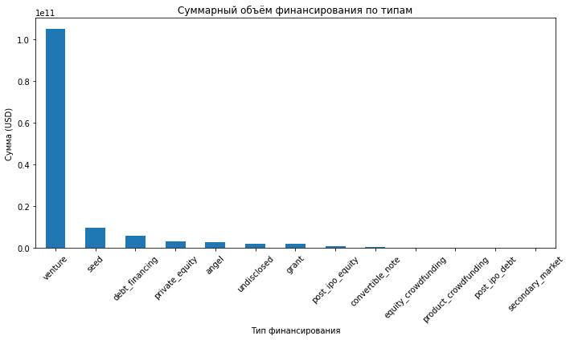
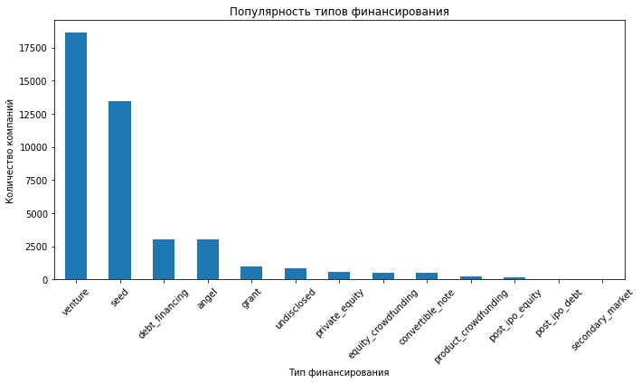
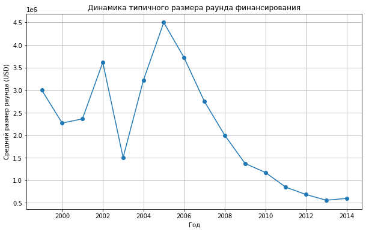
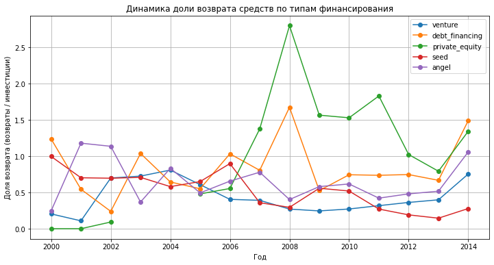

# Анализ рынка стартапов и венчурных инвестиций

---

## Описание проекта

Проект посвящён исследованию рынка стартапов и венчурных инвестиций на основе 
исторических данных о финансировании компаний и возврате инвестиционных средств.

В рамках проекта выполнена предобработка данных, проведён исследовательский анализ структуры
и динамики венчурного финансирования, изучены особенности различных типов инвестиций, 
проанализированы рыночные сегменты, выявлены аномальные значения объёмов финансирования 
и подготовлены рекомендации по формированию инвестиционной стратегии.

---

## Цель проекта

Провести комплексный анализ исторических данных о финансировании стартапов и возврате
инвестиций, выявить закономерности венчурного рынка, определить наиболее 
перспективные направления инвестирования и сформулировать рекомендации по выбору 
инвестиционной стратегии.

---

## Бизнес-задачи

В рамках проекта необходимо было:

- подготовить данные для проведения анализа;
- исследовать структуру финансирования стартапов;
- определить группы компаний по срокам привлечения инвестиций;
- классифицировать рыночные сегменты по распространённости;
- выявить аномальные объёмы финансирования;
- проанализировать популярность и объёмы различных типов финансирования;
- исследовать динамику инвестиционной активности по годам;
- оценить долю возврата средств по различным типам финансирования;
- подготовить рекомендации по выбору перспективных направлений инвестирования.

---

## Используемые инструменты
- Python
- Pandas
- NumPy
- Matplotlib
- Seaborn
- Jupyter Notebook
- Предобработка данных
- Инжиниринг признаков
- Исследовательский анализ данных (EDA)
- Анализ выбросов (IQR)
- Визуализация данных

---

## Этапы выполнения проекта

### Предобработка данных
- Загрузка и первичное изучение данных 
- Приведение названий столбцов к единому стилю.
- Преобразование типов данных.
- Удаление явных дубликатов и пропусков.
- Обработка пропусков в текстовых столбцах.

### Инжиниринг признаков
- Разделение компаний на группы по срокам финансирования.
- Классификация сегментов рынка.

### Исследовательский анализ данных (EDA)
- Анализ распределения компаний и инвестиций по группам сроков финансирования.
- Анализ структуры рынка: выделение массовых, средних и нишевых сегментов.
- Выявление компаний с аномально высоким объемом финансирования.
- Анализ популярности и суммарных объемов различных типов финансирования.

### Анализ динамики финансирования
- Изучение динамики типичного размера раунда финансирования по годам.
- Анализ активности рынка по количеству раундов финансирования.
- Выделение массовых сегментов, показавших рост суммарного финансирования.

### Анализ возврата инвестиций
- Расчет доли возврата средств по годам для каждого типа финансирования.
- Очистка данных от выбросов.
- Сравнение средней доли возврата для различных типов финансирования.

---

## Основные результаты

В ходе анализа удалось:
- подготовить данные для дальнейшего исследования;
- выделить группы компаний по срокам финансирования и оценить их вклад в 
общий объём инвестиций;
- классифицировать рыночные сегменты на массовые, средние и нишевые;
- определить сегменты с наибольшей долей компаний, получивших аномальное 
финансирование;
- выявить наиболее популярные и наиболее капиталоёмкие типы финансирования;
- исследовать динамику типичного размера инвестиционного раунда и 
активности рынка по годам;
- определить отраслевые сегменты, демонстрирующие устойчивый рост объёмов 
финансирования;
- оценить динамику доли возврата средств по различным типам финансирования;
- подготовить рекомендации по выбору перспективных направлений инвестирования.

---

## Практическая ценность

Полученные результаты позволяют:
- принимать решения на основе данных при формировании инвестиционного портфеля;
- оценивать инвестиционную привлекательность различных отраслей рынка стартапов;
- выявлять наиболее эффективные инструменты финансирования;
- учитывать влияние аномальных значений при анализе инвестиционных данных;
- определять перспективные направления развития венчурного рынка;
- использовать исторические данные для оценки потенциальных инвестиционных рисков.

---

## Структура проекта

| Файл | Описание |
| --- | --- |
| [startup-investment-analysis.ipynb](notebooks/startup-investment-analysis.ipynb) | Jupyter Notebook с полным кодом анализа, визуализациями и выводами |
| `images/` | Папка с ключевыми визуализациями |

---

## Демонстрация проекта

Доля компаний по сроку финансирования

Доля инвестиций по сроку финансирования

Распределение компаний по типам сегментов

Суммарный объём финансирования по типам

Популярность типов финансирования

Динамика типичного размера раунда финансирования

Динамика доли возврата средств по типам финансирования

---

## Автор
Проект выполнен в рамках развития навыков аналитики данных и демонстрирует опыт работы 
с Python, исследовательским анализом данных, визуализацией, анализом бизнес-показателей 
и подготовкой аналитических выводов.