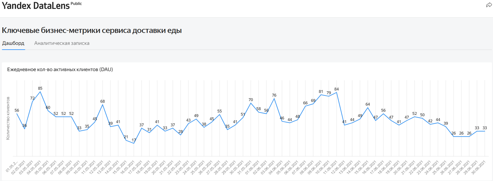
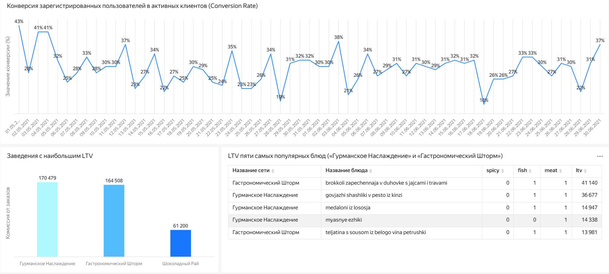

# Расчёт ключевых бизнес-метрик сервиса доставки еды

## Описание проекта

Проект посвящён анализу ключевых бизнес-метрик сервиса доставки еды. 
В рамках проекта были рассчитаны показатели пользовательской активности, конверсии, 
среднего чека, удержания клиентов и LTV, а также разработан интерактивный дашборд в 
Yandex DataLens для мониторинга эффективности сервиса.

По результатам анализа подготовлена аналитическая записка с выводами и рекомендациями, 
позволяющими оценить текущее состояние клиентской базы, выявить проблемные зоны и определить 
потенциальные направления развития продукта.

## Ссылка на проект

Yandex DataLens: https://datalens.yandex/w6o3q5vgjrjwg

## Цель проекта

Разработать аналитический дашборд для мониторинга ключевых бизнес-метрик сервиса доставки еды, 
оценить динамику пользовательской активности, эффективности привлечения и удержания клиентов, 
а также выявить точки роста бизнеса.

## Бизнес-задачи

В рамках проекта необходимо было:

- рассчитать ключевые бизнес-метрики сервиса доставки еды;
- оценить динамику ежедневной активности пользователей (DAU);
- проанализировать коэффициент конверсии зарегистрированных пользователей в активных клиентов;
- исследовать изменение среднего чека;
- оценить удержание пользователей (Retention Rate);
- определить рестораны с наибольшим LTV и проанализировать наиболее популярные блюда;
- подготовить аналитические выводы и рекомендации для бизнеса.

## Используемые инструменты

- SQL
- PostgreSQL
- Yandex DataLens
- BI-визуализация данных
- SQL-запросы
- Расчёт бизнес-метрик (DAU, Conversion Rate, Average Check, LTV, Retention Rate)
- Подготовка аналитической записки

## Реализованный функционал

В дашборде представлены:

- динамика ежедневной активности пользователей (DAU);
- анализ коэффициента конверсии (Conversion Rate);
- показатели среднего чека;
- рейтинг ресторанов с наибольшим LTV;
- анализ LTV наиболее популярных блюд;
- динамика удержания пользователей (Retention Rate);
- аналитическая записка с ключевыми выводами и рекомендациями.

## Основные результаты

В ходе анализа удалось:

- выявить положительную динамику ежедневной активности пользователей с отдельными пиковыми 
значениями в праздничные дни;
- определить снижение коэффициента конверсии к концу анализируемого периода;
- зафиксировать рост среднего чека по сравнению с предыдущим месяцем;
- выявить критически низкий уровень удержания пользователей, требующий первоочередного внимания;
- определить рестораны, формирующие наибольший LTV, а также особенности наиболее популярных блюд.

## Практическая ценность

Полученные результаты позволяют:

- принимать решения на основе данных;
- контролировать динамику ключевых бизнес-показателей сервиса;
- своевременно выявлять проблемные зоны пользовательского поведения;
- оценивать эффективность удержания клиентов;
- определять перспективные направления развития продукта и маркетинговых активностей.

## Структура проекта

| Файл | Описание |
| --- | --- |
| [business-metrics.sql](sql/business-metrics.sql) | SQL-запросы для расчёта ключевых бизнес-метрик и построения дашборда |
| `images/01-daily-active-users.png` | График ежедневной активности пользователей (DAU) |
| `images/02-conversion-and-ltv-analysis.png` | Анализ конверсии пользователей и показателей LTV |
| `images/03-average-check-and-retention.png` | Анализ среднего чека и удержания пользователей |

## Демонстрация дашборда

### Ежедневная активность пользователей (DAU)

---

### Анализ конверсии и LTV

---

### Средний чек и удержание пользователей

## Автор

Проект выполнен в рамках развития навыков аналитики данных и демонстрирует опыт разработки BI-решений, 
написания SQL-запросов, расчёта ключевых бизнес-метрик, визуализации данных в Yandex DataLens и 
подготовки аналитических материалов для принятия решений.