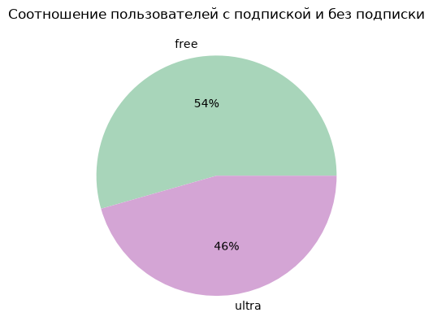
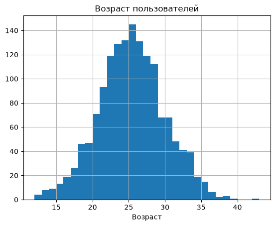
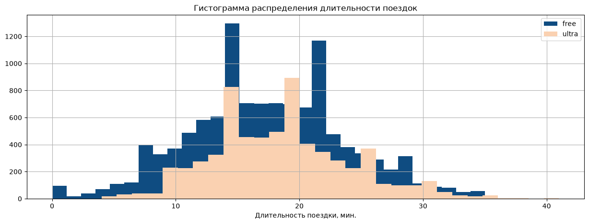

# Проверка гипотез в бизнесе для сервиса проката самокатов

## Описание проекта

Проект посвящён анализу данных сервиса проката самокатов с целью оценки эффективности платной подписки и 
изучения особенностей поведения пользователей.

В рамках проекта проведены предобработка и объединение данных о пользователях, поездках и тарифах, 
выполнен исследовательский анализ пользовательской базы, рассчитана помесячная выручка, 
проверены статистические гипотезы, а также смоделированы распределения длительности и 
расстояния поездок для решения прикладных бизнес-задач.

## Цель проекта

Оценить эффективность платной подписки, выявить различия в поведении пользователей различных тарифных планов и 
подготовить рекомендации по развитию подписочной модели и повышению экономической эффективности сервиса.

## Бизнес-задачи

В рамках проекта необходимо было:

- исследовать демографические характеристики пользователей сервиса;
- проанализировать особенности использования самокатов пользователями различных тарифов;
- оценить влияние подписки на продолжительность поездок и получаемую выручку;
- проверить статистические гипотезы о различиях между пользователями с подпиской и без подписки;
- оценить вероятность длительных поездок и определить критическую дистанцию для 
управления эксплуатационными расходами;
- подготовить рекомендации по развитию подписочной модели и проведению маркетинговых мероприятий.

## Используемые инструменты

- Python
- pandas
- Matplotlib
- SciPy
- Jupyter Notebook
- Предобработка данных
- Исследовательский анализ данных (EDA)
- Статистический анализ
- Проверка статистических гипотез
- t-тест
- Моделирование распределений (CDF, PPF)
- Визуализация данных

## Этапы выполнения проекта

### Предобработка данных

- загрузка и изучение структуры данных;
- проверка качества данных;
- обработка дубликатов;
- преобразование типов данных;
- создание дополнительных признаков.

### Исследовательский анализ данных

Проведён анализ:

- структуры пользовательской базы;
- распределения пользователей по городам;
- возрастного состава пользователей;
- распределения поездок по длительности и расстоянию;
- различий между пользователями различных тарифов.

### Объединение данных и расчёт бизнес-метрик

- объединены данные пользователей, поездок и тарифов;
- рассчитаны агрегированные показатели использования сервиса;
- рассчитана помесячная выручка пользователей с учётом условий тарифных планов.

### Статистический анализ

- проверены гипотезы о различиях в продолжительности поездок;
- проверена гипотеза о соответствии средней дистанции критическому значению;
- выполнено сравнение помесячной выручки пользователей различных тарифов.

### Моделирование распределений

- рассчитаны параметры нормального распределения;
- оценена вероятность длительных поездок;
- определена доля поездок в заданном интервале длительности;
- рассчитана критическая дистанция.

### Подготовка выводов

По результатам исследования сформулированы выводы и практические рекомендации для 
развития подписочной модели и повышения эффективности сервиса.

## Основные результаты

В ходе анализа удалось:

- выполнить комплексную подготовку и объединение данных о пользователях, поездках и тарифах;
- определить особенности пользовательской базы и поведения клиентов сервиса;
- выявить различия между пользователями с подпиской и без подписки;
- подтвердить статистическую значимость различий в продолжительности поездок и уровне выручки;
- оценить вероятность длительных поездок и определить критическую дистанцию для контроля 
эксплуатационных расходов;
- подготовить практические рекомендации по развитию подписочной модели и управлению 
пользовательской активностью.

## Практическая ценность

Полученные результаты позволяют:

- принимать решения на основе данных при развитии подписочной модели;
- оценивать экономическую эффективность тарифных планов;
- выявлять перспективные направления развития продукта;
- определять целевую аудиторию для маркетинговых кампаний;
- управлять эксплуатационными расходами за счёт оценки критических дистанций поездок.

## Структура проекта

| Файл | Описание |
| --- | --- |
| [notebooks/scooter_subscription_analysis.ipynb](notebooks/scooter_subscription_analysis.ipynb) | Jupyter Notebook с полным циклом анализа данных, статистическими проверками и выводами |
| `images/01-subscription-type-distribution.png` | Соотношение пользователей с подпиской и без подписки |
| `images/02-user-age-distribution.png` | Распределение пользователей по возрасту |
| `images/03-ride-duration-distribution.png` | Распределение продолжительности поездок |

## Демонстрация проекта

### Соотношение пользователей с подпиской и без подписки

### Распределение пользователей по возрасту

### Распределение продолжительности поездок

## Автор

Проект выполнен в рамках развития навыков аналитики данных и демонстрирует опыт работы 
с Python, pandas, SciPy, исследовательским анализом данных, статистическим анализом, 
проверкой гипотез, моделированием распределений, визуализацией данных и подготовкой 
бизнес-рекомендаций.