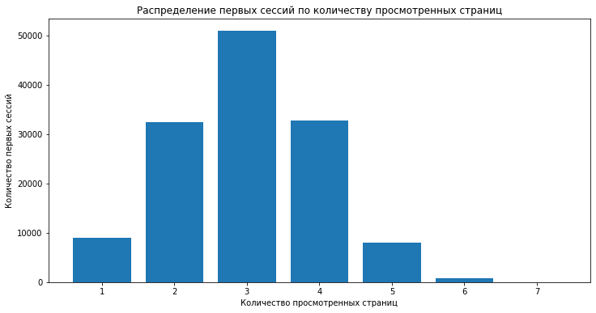
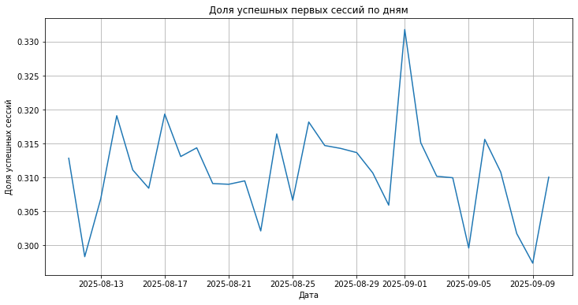
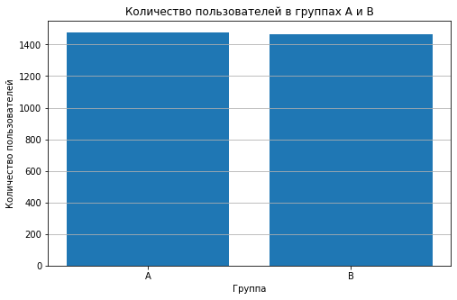
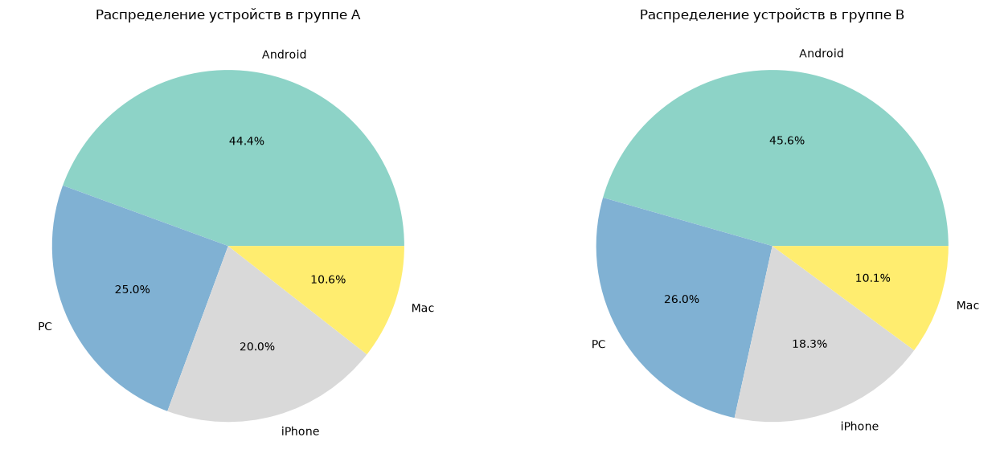
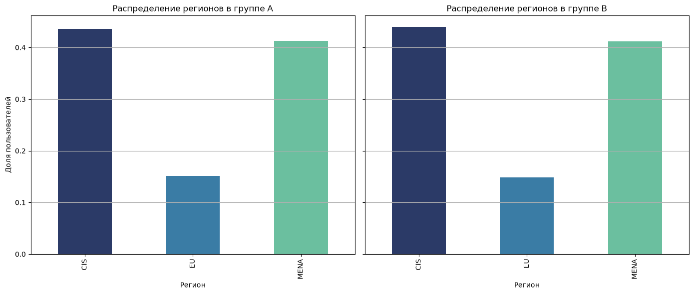

# Оценка эффективности нового алгоритма рекомендаций в развлекательном приложении (A/B-тест)

## Описание проекта

Проект посвящен оценке эффективности нового алгоритма рекомендаций в развлекательном приложении с бесконечной лентой контента.

В рамках проекта проведен анализ пользовательского поведения, рассчитаны параметры A/B-теста, выполнена проверка корректности проведения эксперимента и проведена статистическая оценка результатов. На основе полученных данных определено, оказывает ли новый алгоритм рекомендаций значимое влияние на ключевую продуктовую метрику.

## Цель проекта

Оценить эффективность нового алгоритма рекомендаций и определить целесообразность его внедрения на основе результатов A/B-тестирования.

## Бизнес-задачи

В рамках проекта необходимо было:

- изучить исторические данные пользовательских сессий;
- определить ключевую метрику для оценки эффективности алгоритма;
- рассчитать параметры A/B-теста: необходимый размер выборки и длительность эксперимента;
- проверить корректность формирования тестовых групп;
- оценить влияние нового алгоритма на пользовательское поведение;
- провести статистическую проверку различий между контрольной и тестовой группами;
- подготовить выводы и рекомендации по результатам эксперимента.

## Используемые инструменты

- Python
- pandas
- NumPy
- Matplotlib
- SciPy
- StatsModels
- Jupyter Notebook
- Исследовательский анализ данных (EDA)
- A/B-тестирование
- Статистическая проверка гипотез
- Визуализация данных

## Этапы выполнения проекта

### Подготовка и исследование данных

Проведен анализ исторических данных пользовательских сессий:

- изучена структура данных;
- проверена корректность пользовательских атрибутов;
- проанализирована активность пользователей;
- исследованы показатели регистрации и глубины просмотра контента.

### Расчет параметров A/B-теста

Определены основные параметры эксперимента:

- базовый уровень ключевой метрики;
- минимальный обнаруживаемый эффект (MDE);
- необходимый размер выборки;
- рекомендуемая длительность эксперимента.

### Проверка корректности проведения эксперимента

Выполнена проверка качества A/B-теста:

- оценено распределение пользователей между группами A и B;
- проверено отсутствие пересечений пользователей;
- проведен анализ баланса групп по устройствам;
- выполнена проверка распределения пользователей по регионам.

### Анализ результатов эксперимента

Проведено сравнение контрольной и тестовой групп:

- рассчитана ключевая продуктовая метрика;
- выполнено сравнение результатов групп;
- проведен статистический тест для оценки значимости различий;
- сформированы рекомендации по дальнейшему использованию алгоритма.

## Основные результаты

В ходе анализа удалось:

- определить ключевую метрику для оценки эффективности алгоритма рекомендаций;
- рассчитать параметры проведения A/B-теста и оценить требования к размеру выборки;
- проверить корректность формирования тестовой и контрольной групп;
- выявить отсутствие существенных различий между группами по ключевым характеристикам пользователей;
- провести статистическую оценку результатов эксперимента;
- определить, оказывает ли новый алгоритм рекомендаций значимое влияние на пользовательскую активность;
- подготовить рекомендации по дальнейшему развитию и повторному тестированию алгоритма.

## Практическая ценность

Полученные результаты позволяют:

- принимать решения на основе данных при внедрении изменений в продукт;
- оценивать эффективность новых алгоритмов и функциональных улучшений;
- снижать риски внедрения решений без подтвержденного эффекта;
- выявлять направления для дальнейшей оптимизации пользовательского опыта;
- формировать обоснованные рекомендации для продуктовой команды.

## Структура проекта

| Файл | Описание |
| --- | --- |
| [notebooks/ab_test_recommendation_analysis.ipynb](notebooks/ab_test_recommendation_analysis.ipynb) | Jupyter Notebook с полным анализом данных, расчетами и статистической проверкой гипотез |
| `images/01-first-session-pages-distribution.png` | Распределение первых сессий по количеству просмотренных страниц |
| `images/02-successful-sessions-by-day.png` | Динамика доли успешных первых сессий по дням |
| `images/03-users-by-test-groups.png` | Распределение пользователей между группами A и B |
| `images/04-devices-distribution-by-group.png` | Проверка распределения пользователей по устройствам |
| `images/05-regions-distribution-by-group.png` | Проверка распределения пользователей по регионам |
| `.gitignore` | Настройки исключения исходных данных и временных файлов из репозитория |

## Демонстрация проекта

### Выбор ключевой метрики

### Анализ стабильности ключевой метрики

### Проверка корректности распределения пользователей

### Проверка баланса групп по устройствам

### Проверка баланса групп по регионам

## Автор

Проект выполнен в рамках развития навыков аналитики данных и демонстрирует опыт 
работы с Python, исследовательским анализом данных, A/B-тестированием, статистическим 
анализом, визуализацией данных и формированием продуктовых рекомендаций.