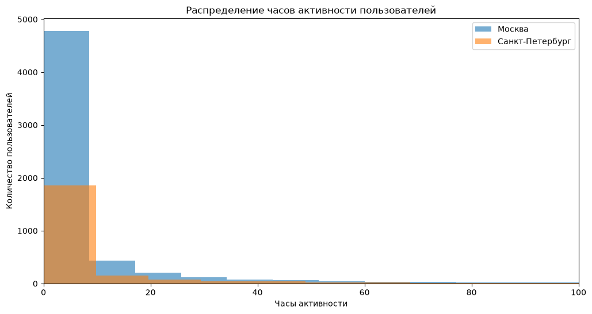
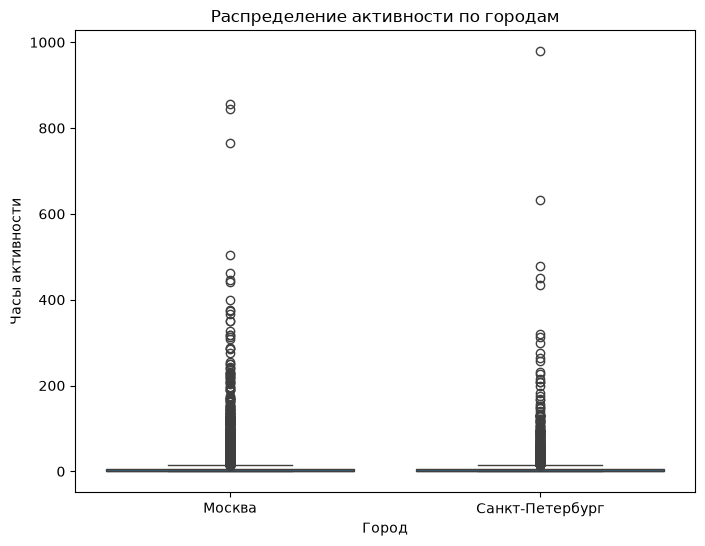

# Проверка статистической гипотезы и анализ результатов A/B-тестирования

## Описание проекта

Проект посвящён статистическому анализу пользовательских данных и оценке 
результатов A/B-тестирования. Исследование состоит из двух независимых частей.

В первой части проведена проверка статистической гипотезы о различиях в пользовательской 
активности между Москвой и Санкт-Петербургом на основе данных сервиса Яндекс Книги. 
Во второй части выполнен комплексный анализ результатов A/B-тестирования нового интерфейса 
интернет-магазина: проверена корректность проведения эксперимента, рассчитаны ключевые 
продуктовые метрики и оценено влияние изменений интерфейса на конверсию пользователей 
в покупателей.

## Цель проекта

Провести статистический анализ пользовательских данных для проверки гипотез о поведении 
пользователей и оценить эффективность продуктовых изменений на основе результатов 
A/B-тестирования.

## Бизнес-задачи

В рамках проекта необходимо было:

- определить наличие статистически значимых различий в пользовательской активности 
жителей Москвы и Санкт-Петербурга;
- оценить корректность проведения A/B-тестирования нового интерфейса интернет-магазина;
- исследовать поведение пользователей контрольной и тестовой групп;
- определить влияние изменений интерфейса на конверсию пользователей в покупателей;
- подготовить рекомендации по результатам статистического анализа и 
проведённого эксперимента.

## Используемые инструменты

- Python
- Pandas
- NumPy
- Matplotlib
- Seaborn
- SciPy
- StatsModels
- Jupyter Notebook
- Исследовательский анализ данных (EDA)
- Предобработка данных
- Статистический анализ
- Проверка статистических гипотез
- t-тест Уэлча
- Z-тест для сравнения долей
- Анализ A/B-тестирования
- Анализ конверсии пользователей
- Визуализация данных

## Этапы выполнения проекта

### Проверка статистической гипотезы

- загрузка и подготовка данных;
- проверка качества данных;
- анализ размеров групп и описательной статистики;
- исследование распределения пользовательской активности;
- формулировка и проверка статистической гипотезы;
- интерпретация результатов и подготовка аналитической записки.

### Анализ результатов A/B-тестирования

- загрузка и подготовка данных эксперимента;
- проверка корректности проведения теста;
- анализ состава экспериментальных групп;
- определение горизонта анализа;
- оценка достаточности размера выборки;
- расчёт ключевых продуктовых метрик;
- проверка статистической значимости различий;
- интерпретация результатов и подготовка рекомендаций.

## Основные результаты

### Проверка статистической гипотезы

В ходе статистического анализа пользовательской активности сервиса Яндекс Книги удалось:

- проверить качество исходных данных и подтвердить отсутствие дубликатов идентификаторов пользователей;
- выполнить сравнительный анализ пользовательской активности жителей Москвы и Санкт-Петербурга;
- провести статистическую проверку гипотезы о различиях в среднем времени активности пользователей двух городов с использованием t-теста Уэлча;
- подготовить аналитическую записку с интерпретацией результатов статистического анализа и выводами по исследуемой гипотезе.

### Анализ результатов A/B-тестирования

В ходе анализа результатов A/B-тестирования удалось:

- проверить корректность проведения эксперимента и качество исходных данных;
- исследовать пользовательскую активность контрольной и тестовой групп;
- рассчитать ключевые показатели конверсии и оценить влияние нового интерфейса на поведение пользователей;
- выполнить статистическую проверку различий между экспериментальными группами с использованием z-теста для сравнения долей;
- оценить достижение бизнес-цели эксперимента и подготовить рекомендации по дальнейшему развитию продукта.

## Практическая ценность

Полученные результаты позволяют:

- принимать решения на основе данных при оценке поведения пользователей;
- проверять статистические гипотезы с использованием современных методов анализа;
- оценивать эффективность продуктовых изменений посредством A/B-тестирования;
- выявлять влияние изменений пользовательского интерфейса на ключевые продуктовые метрики;
- формировать рекомендации по развитию цифровых продуктов на основе результатов статистического анализа.

## Структура проекта

| Файл | Описание |
| --- | --- |
| [statistical_hypothesis_and_ab_testing.ipynb](notebooks/statistical_hypothesis_and_ab_testing.ipynb) | Jupyter Notebook с полным ходом исследования, расчётами, визуализациями и итоговыми выводами |
| `images/01-user-activity-hours-distribution.png` | Распределение часов активности пользователей |
| `images/02-user-activity-distribution-by-city.png` | Распределение пользовательской активности по городам |

## Демонстрация проекта

### Распределение часов активности пользователей

### Распределение пользовательской активности по городам

## Автор

Проект выполнен в рамках развития навыков аналитики данных и демонстрирует опыт 
работы с Python, исследовательским анализом данных, статистическим анализом, 
проверкой статистических гипотез, A/B-тестированием, визуализацией данных и подготовкой 
аналитических рекомендаций.