# Анализ продаж и структуры выручки сервиса Яндекс Афиша 

## Описание проекта

Проект посвящен анализу данных о бронировании билетов сервиса Яндекс Афиша за период 
с июня по октябрь 2024 года. В рамках проекта проведена комплексная предобработка данных 
с помощью SQL и Python, исследована структура продаж и динамика пользовательской 
активности, а также изучено влияние сезонности на спрос. 
На основе подготовленных данных разработан интерактивный дашборд в Yandex DataLens и 
выполнен углубленный исследовательский анализ в Jupyter Notebook.

## Ссылка на проект

Yandex DataLens: https://datalens.yandex/rb7fez58f888a

## Цель проекта

Выявить закономерности в пользовательском спросе, определить наиболее популярные 
категории мероприятий и регионы, а также подготовить рекомендации для повышения 
эффективности продаж билетов на платформе.

## Бизнес-задачи

В рамках проекта необходимо было:

- определить динамику пользовательской активности и продаж за период;
- исследовать структуру выручки в разрезе типов мероприятий и устройств;
- выявить сезонные изменения потребительских предпочтений;
- определить наиболее прибыльные регионы и билетные операторы;
- проверить статистические гипотезы о различиях в поведении пользователей мобильных и стационарных устройств;
- подготовить выводы и рекомендации.

## Используемые инструменты

- SQL (PostgreSQL)
- Yandex DataLens
- Python (pandas, NumPy, SciPy, matplotlib, seaborn)
- Jupyter Notebook
- Статистический анализ (критерий Манна-Уитни)
- BI-визуализация

## Этапы выполнения проекта

### SQL-подготовка и первичный анализ данных

- Исследование структуры данных: анализ связей между таблицами, оценка объема и 
полноты данных.
- Проверка качества данных: уникальность идентификаторов, пропущенные значения, 
корректность категориальных данных.
- Исследовательский анализ на уровне базы данных: распределение ключевых показателей, 
выявление аномалий и выбросов, временной анализ.
- Расчет бизнес-метрик для дашборда: общие показатели сервиса, анализ по типам устройств, 
анализ по категориям мероприятий, динамика ключевых метрик, топ-сегменты по регионам.
- Подготовка выводов и рекомендаций для стейкхолдеров на основе SQL-анализа.

### Исследовательский анализ и статистика (Python)

- Загрузка и предобработка данных: проверка качества, обработка пропусков и аномалий, 
приведение показателей к единой валюте.
- Исследовательский анализ данных (EDA): изучение распределений, структуры заказов и 
динамики пользовательской активности.
- Оценка влияния сезонности: сравнение структуры спроса в летний и осенний периоды.
- Статистическая проверка гипотез о различиях в поведении пользователей разных 
типов устройств с использованием непараметрических критериев.
- Формулирование выводов и подготовка рекомендаций на основе результатов анализа.

### Разработка дашборда (Yandex DataLens)

- Подготовка и загрузка данных в среду визуализации.
- Настройка системы фильтров: валюта, период, тип мероприятия, регион.
- Реализация ключевых KPI-показателей на обзорной панели: итоговая выручка, 
количество заказов, средний чек, уникальные покупатели.
- Построение графиков структуры и динамики выручки в разрезе устройств и 
категорий мероприятий.
- Детализация данных в виде рейтинговых таблиц по регионам, событиям и площадкам.
- Публикация дашборда для доступа стейкхолдерам.

### Формулирование итоговых выводов

На основе результатов SQL-выгрузки, исследовательского анализа в Python и разработанного 
дашборда сформулированы итоговые выводы и практические рекомендации для маркетинга и 
продуктовой команды.

## Основные результаты

В ходе анализа удалось:

- выявить устойчивый сезонный рост спроса и определить его ключевые драйверы;
- установить структуру пользовательских предпочтений в разрезе типов мероприятий, 
устройств и возрастных категорий;
- определить наиболее активные регионы и ключевых билетных операторов, 
формирующих основную долю выручки;
- подтвердить статистически значимые различия в поведении пользователей мобильных 
и стационарных устройств;
- разработать интерактивный дашборд для мониторинга ключевых бизнес-показателей;
- подготовить практические рекомендации по сегментации маркетинга и 
оптимизации продуктовой стратегии.

## Практическая ценность

Полученные результаты позволяют:

- принимать решения на основе данных при планировании маркетинговых и продуктовых стратегий;
- оптимизировать распределение рекламных бюджетов с учетом региональной концентрации спроса;
- адаптировать контентную политику сервиса в зависимости от сезонных изменений пользовательских предпочтений;
- сегментировать аудиторию по типам устройств для повышения эффективности коммуникаций;
- сформировать систему KPI для мониторинга текущей эффективности продаж и пользовательской активности;
- использовать разработанный дашборд как центральный инструмент для оперативного контроля бизнес-показателей.

## Структура проекта

| Файл | Описание |
| --- | --- |
| [sql/afisha_dashboard_queries.sql](sql/afisha_dashboard_queries.sql) | Набор SQL-запросов для выгрузки, фильтрации, исследования структуры данных и расчета агрегированных бизнес-метрик для последующей визуализации. |
| [notebooks/afisha_sales_analysis.ipynb](notebooks/afisha_sales_analysis.ipynb) | Jupyter Notebook с полным циклом исследовательского анализа (EDA): предобработка данных, проверка статистических гипотез и подготовка выводов. |

## Демонстрация дашборда

**Обзорная панель с ключевыми показателями**

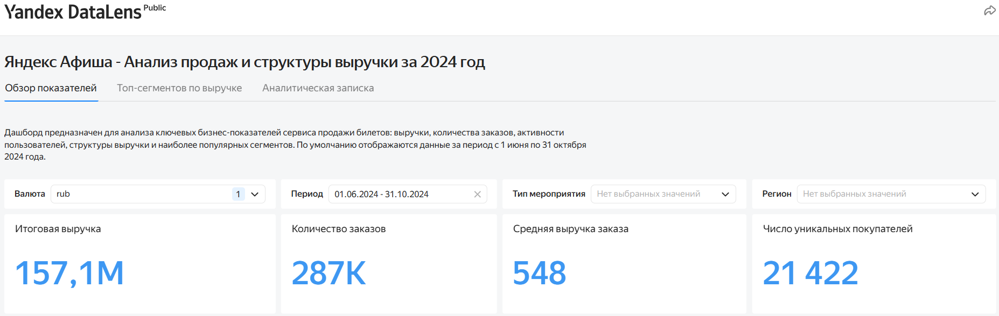

**Структура выручки по типам устройств и типам мероприятий**

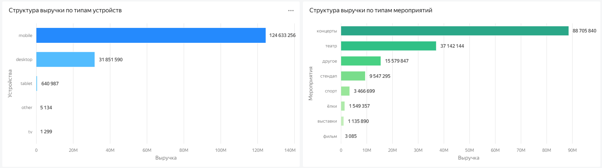

**Недельная динамика выручки**

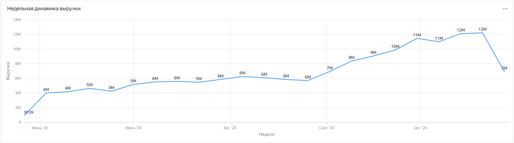

**Недельная динамика количества заказов**

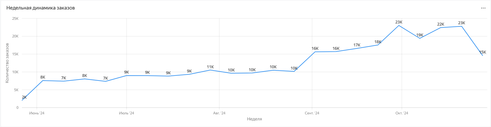

**Недельная динамика среднего чека заказа**

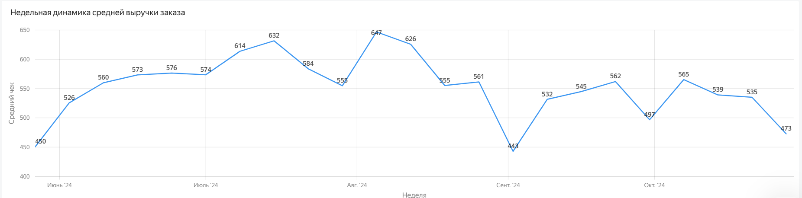

**Топ-10 регионов по объему выручки**

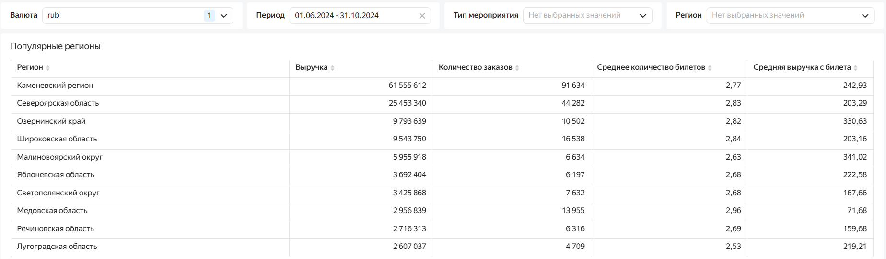

**Наиболее популярные события по объему выручки**

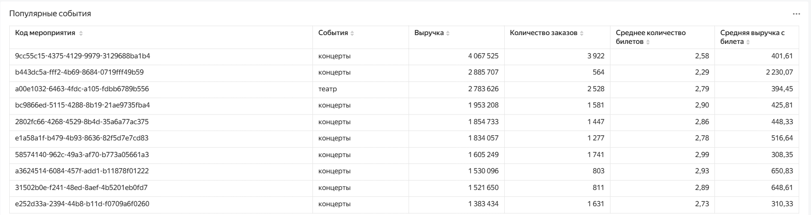

**Топ-10 площадок по объему выручки**

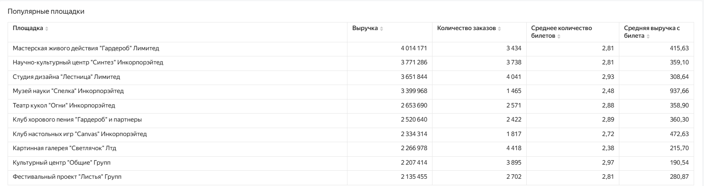

## Демонстрация аналитических графиков (Python)

**Динамика количества заказов по месяцам (июнь – октябрь 2024)**

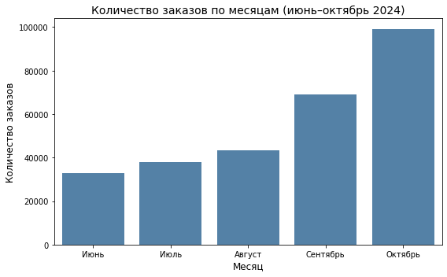

**Динамика ежедневной активной аудитории (DAU) осенью 2024 года**

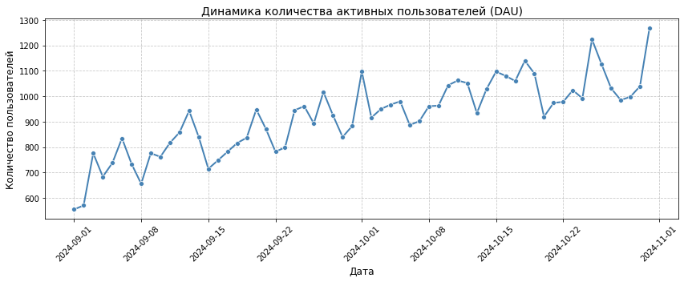

**Сравнение структуры заказов по типам мероприятий: лето против осени**

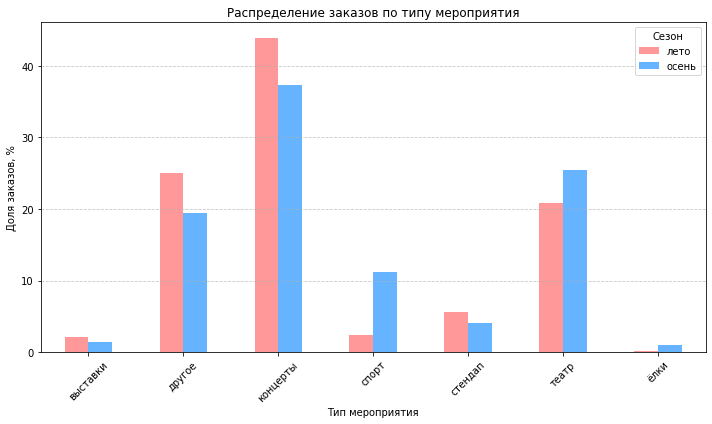

**Распределение заказов по типам устройств: лето против осени**

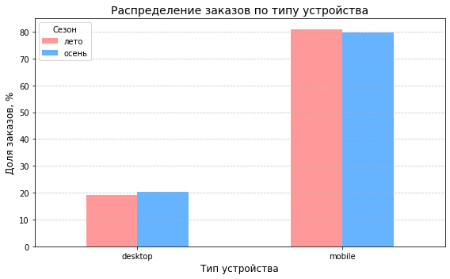

**Топ-10 регионов по объему заказов**

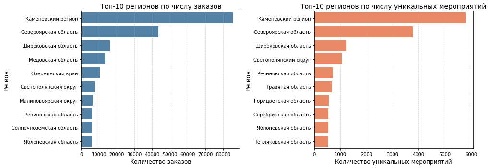

## Автор

Проект выполнен в рамках развития навыков аналитики данных и демонстрирует опыт работы 
с SQL, Yandex DataLens, Python, статистическим анализом, исследовательским 
анализом данных (EDA), подготовкой аналитических отчетов и формированием 
бизнес-рекомендаций.